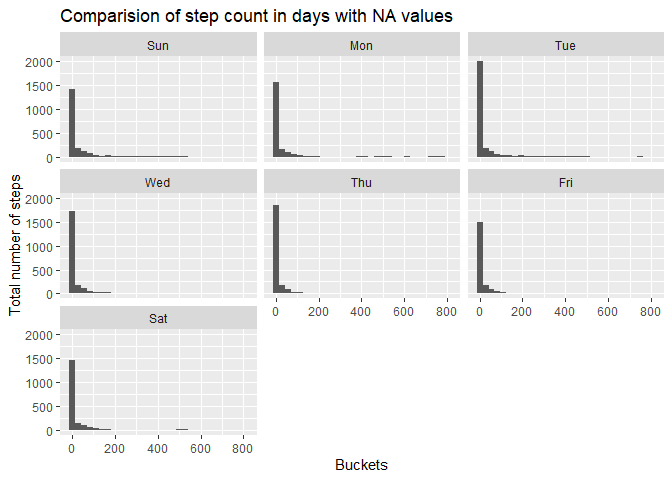
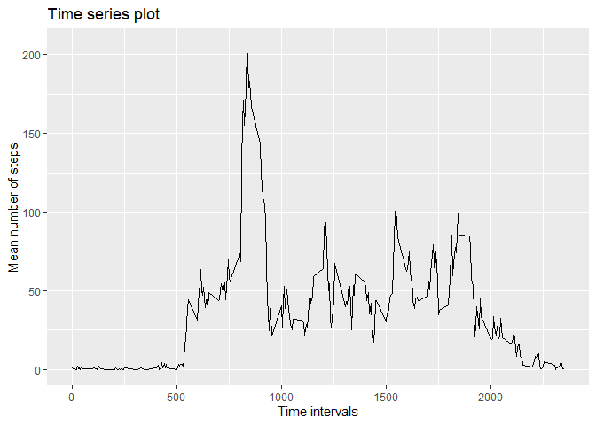
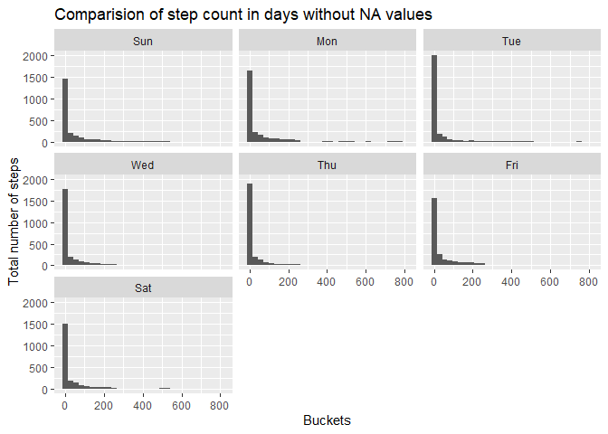
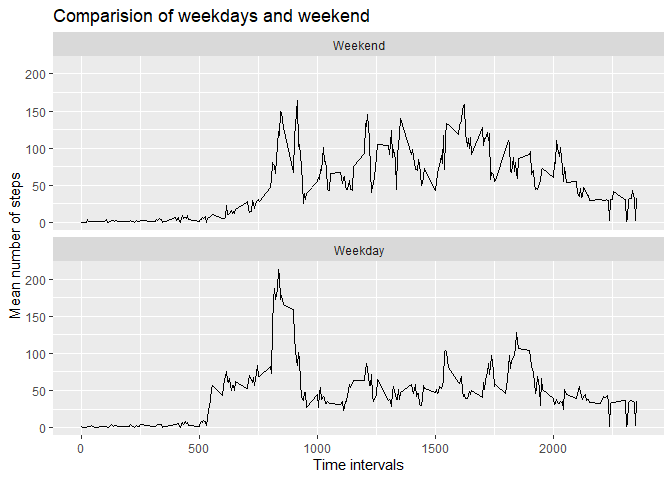

## Loading and preprocessing the data

We use **read.csv** to read all the data, no additional library needed.


```r
dane <- read.csv("activity.csv" )
head(dane)
```

```
##   steps       date interval
## 1    NA 2012-10-01        0
## 2    NA 2012-10-01        5
## 3    NA 2012-10-01       10
## 4    NA 2012-10-01       15
## 5    NA 2012-10-01       20
## 6    NA 2012-10-01       25
```

There will be several steps that are needed to be performed that data woul be able to answer all the questions. First, we add a proper day column using **wday**.


```r
library(lubridate)
```

```
## 
## Dołączanie pakietu: 'lubridate'
```

```
## Następujące obiekty zostały zakryte z 'package:base':
## 
##     date, intersect, setdiff, union
```

```r
dane$day <- wday(dane$date,label=TRUE,locale = "US")
levels(dane$day)
```

```
## [1] "Sun" "Mon" "Tue" "Wed" "Thu" "Fri" "Sat"
```

As we see the dates are in the string format.

## What is mean total number of steps taken per day?

Now everything is ready to display a total number of steps. No additional caculations are needed, everything will be done by the **ggplot** plotting package.


```r
library(ggplot2)
ggplot( dane , aes( steps )) + geom_histogram(na.rm = TRUE) +
  facet_wrap(.~day) +
  ylab("Total number of steps") +
  xlab("Buckets")  + 
  ggtitle("Comparision of step count in days with NA values")
```

```
## `stat_bin()` using `bins = 30`. Pick better value with `binwidth`.
```

<!-- -->

It clrearly looks like that some days have more total counts then other.


In oreder to calculate the mean and median we need to use a **summarize** method. The packeges needed to do that calculations are at the top of the code snipsheat below.


```r
library(tidyr)
library(dplyr)
```

```
## 
## Dołączanie pakietu: 'dplyr'
```

```
## Następujące obiekty zostały zakryte z 'package:stats':
## 
##     filter, lag
```

```
## Następujące obiekty zostały zakryte z 'package:base':
## 
##     intersect, setdiff, setequal, union
```

```r
dane %>% group_by( date ) %>%
  summarise( day,TOTAL = sum(steps,na.rm=T) ) %>%
  ungroup() %>%
  group_by( day ) %>%
  summarize( MEAN = mean(TOTAL,na.rm=T),MEDIAN = median(TOTAL,na.rm=T) ) %>%
  ungroup()
```

```
## Warning: Returning more (or less) than 1 row per `summarise()` group was deprecated in
## dplyr 1.1.0.
## ℹ Please use `reframe()` instead.
## ℹ When switching from `summarise()` to `reframe()`, remember that `reframe()`
##   always returns an ungrouped data frame and adjust accordingly.
## Call `lifecycle::last_lifecycle_warnings()` to see where this warning was
## generated.
```

```
## `summarise()` has grouped output by 'date'. You can override using the
## `.groups` argument.
```

```
## # A tibble: 7 × 3
##   day     MEAN MEDIAN
##   <ord>  <dbl>  <dbl>
## 1 Sun   10743  11646 
## 2 Mon    7758. 10139 
## 3 Tue    8950.  8918 
## 4 Wed   10481. 11352 
## 5 Thu    7300.  7047 
## 6 Fri    9613. 10600 
## 7 Sat   10968. 11498.
```
 
Output is as expected.


## What is the average daily activity pattern?

In order to show the daily pattern we need to do some preprocessing. First we need a **mean** for each **interval**.


```r
tmp <- dane %>% group_by(interval) %>%
  summarize(  MEAN = mean(steps,na.rm=T) )
head(tmp)
```

```
## # A tibble: 6 × 2
##   interval   MEAN
##      <int>  <dbl>
## 1        0 1.72  
## 2        5 0.340 
## 3       10 0.132 
## 4       15 0.151 
## 5       20 0.0755
## 6       25 2.09
```

Then we can plot the mean on the time series plot. It could be easly done by using **geom_path**.


```r
ggplot( tmp , aes( interval,MEAN )) + geom_path(type = "l" ) +
  ylab("Mean number of steps") +
  xlab("Time intervals")  + ggtitle("Time series plot")
```

```
## Warning in geom_path(type = "l"): Ignoring unknown parameters: `type`
```

<!-- -->

As we see the starting (morining) and ending (night) intervals have lower step counts comparing to the middle intervals.


Next we will answer the question which of the intervls has the highest mean.


```r
idx <- which.max(tmp$MEAN)
tmp$interval[idx]
```

```
## [1] 835
```

The output is done in minuets.

## Imputing missing values

We want to check all the missing numbers in the data frame.


```r
print(sum(is.na(dane$steps)))
```

```
## [1] 2304
```

```r
print(sum(is.na(dane$interval)))
```

```
## [1] 0
```

```r
print(sum(is.na(dane$date)))
```

```
## [1] 0
```

As we see there is only missing values in the **steps** column.


To fill the **NA** values for the **steps** we will caculate the mean value for each interval. Then we will fill these values in the missg spots. All will be saved in the new column **steps_noNA**. First step is some preprocessing.


```r
tab_mean <- dane %>%
  group_by(interval) %>%
  summarize(  MEAN = mean(steps,na.rm=T) )
fill_tab <- factor( dane$interval,   levels=tab_mean$interval , labels = tab_mean$MEAN)
dane$steps_noNA <- dane$steps
NAidx <- is.na(dane$steps)
```

Next we fill the missing values in new columns and check if there are any **NA** values.


```r
dane[NAidx,"steps_noNA"] <- fill_tab[NAidx]
sum(is.na(dane$steps_noNA))
```

```
## [1] 0
```

We plot the new time series plot as we did in previous section.


```r
ggplot( dane , aes( steps_noNA )) +
  geom_histogram(na.rm = TRUE) +
  facet_wrap(.~day) +
  ylab("Total number of steps") +
  xlab("Buckets")  + ggtitle("Comparision of step count in days without NA values")
```

```
## `stat_bin()` using `bins = 30`. Pick better value with `binwidth`.
```

<!-- -->

Then we check if the mean and median number of the data set that have filled values have different summarization for each day.


```r
dane %>% group_by( date ) %>%
  summarise( day,TOTAL = sum(steps_noNA,na.rm=T) ) %>%
  ungroup() %>%
  group_by( day ) %>%
  summarize( MEAN = mean(TOTAL,na.rm=T),MEDIAN = median(TOTAL,na.rm=T) ) %>%
  ungroup()
```

```
## Warning: Returning more (or less) than 1 row per `summarise()` group was deprecated in
## dplyr 1.1.0.
## ℹ Please use `reframe()` instead.
## ℹ When switching from `summarise()` to `reframe()`, remember that `reframe()`
##   always returns an ungrouped data frame and adjust accordingly.
## Call `lifecycle::last_lifecycle_warnings()` to see where this warning was
## generated.
```

```
## `summarise()` has grouped output by 'date'. You can override using the
## `.groups` argument.
```

```
## # A tibble: 7 × 3
##   day     MEAN MEDIAN
##   <ord>  <dbl>  <dbl>
## 1 Sun   14887. 12221 
## 2 Mon   15126. 10765 
## 3 Tue    8950.  8918 
## 4 Wed   14164. 12787 
## 5 Thu   10984  10056 
## 6 Fri   16981. 13294 
## 7 Sat   15113. 13382.
```

And as we expected there is.

## Are there differences in activity patterns between weekdays and weekends?

First step is to divide the subset into weekdays and weekend. In order to achive that we make a new column that will contain the string intending if this is a **weekend** or **weekday**.


```r
lvl <- levels(dane$day)
labls <- c("Weekend",rep("Weekday",5), "Weekend")
labls
```

```
## [1] "Weekend" "Weekday" "Weekday" "Weekday" "Weekday" "Weekday" "Weekend"
```

We save this in new column **dinfo** and use **factor** function to calculate proper labels.


```r
dane$dinfo <-factor( dane$day ,levels = lvl , labels = labls )
head(dane$dinfo)
```

```
## [1] Weekday Weekday Weekday Weekday Weekday Weekday
## Levels: Weekend < Weekday
```

Next we need to calculate the mean value for each day type and interval.


```r
tmp <- dane %>% group_by(dinfo,interval) %>%
  summarize(  MEAN = mean(steps_noNA,na.rm=T) , )
```

```
## `summarise()` has grouped output by 'dinfo'. You can override using the
## `.groups` argument.
```

```r
head(tmp)
```

```
## # A tibble: 6 × 3
## # Groups:   dinfo [1]
##   dinfo   interval  MEAN
##   <ord>      <int> <dbl>
## 1 Weekend        0 0.125
## 2 Weekend        5 0.25 
## 3 Weekend       10 0.375
## 4 Weekend       15 0.5  
## 5 Weekend       20 0.625
## 6 Weekend       25 4
```

And finally we can plot it.


```r
ggplot( tmp , aes( interval,MEAN )) + geom_path(type = "l" ) +
  facet_wrap(.~dinfo,nrow=2) +ylab("Mean number of steps") +
  xlab("Time intervals")  + ggtitle("Comparision of weekdays and weekend")
```

```
## Warning in geom_path(type = "l"): Ignoring unknown parameters: `type`
```

<!-- -->

As we see there is more movement in the weekends but the peak is greater in weekdays.
